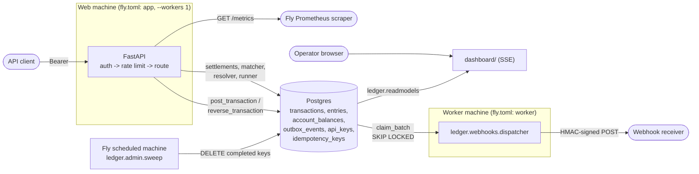
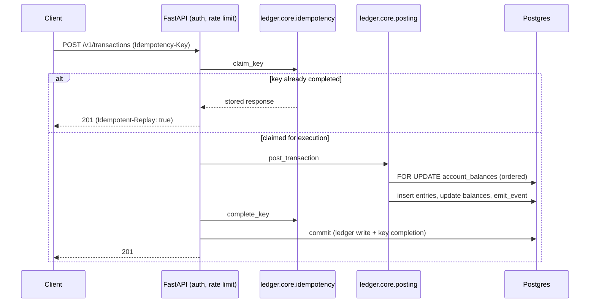

# Ledgerline

Idempotent payments ledger and reconciliation engine. See [`SPEC.md`](SPEC.md) for the full build specification and [`docs/ARCHITECTURE.md`](docs/ARCHITECTURE.md) / [`docs/DECISIONS.md`](docs/DECISIONS.md) for current implementation notes.

## Architecture





## Development

```bash
cp .env.example .env          # edit if needed
docker compose up -d db
pip install -e ".[dev]"
alembic upgrade head
uvicorn ledger.api.main:app --reload
```

Run tests (spins up a throwaway Postgres via testcontainers if `DATABASE_URL` isn't set):

```bash
pytest
```

## Dashboard

A server-rendered live view of the ledger (Jinja2 + htmx, SSE for updates) at [http://localhost:8000/dashboard](http://localhost:8000/dashboard) — account balances, recent transactions, reconciliation run history and open findings, and the webhook delivery queue with per-delivery retry countdowns and DLQ depth.

```bash
docker compose up            # api + dashboard + webhook worker + db
python -m scripts.seed       # accounts and a small transaction history
```

Panels refresh from `GET /dashboard/sse`, a `text/event-stream` endpoint that pushes a fresh snapshot every `DASHBOARD_SSE_INTERVAL_SECONDS` (default 2s) for whichever panels changed.

### Demo scenario

The **Run demo scenario** button (`POST /dashboard/demo`, also `python -m scripts.demo`) seeds a scenario with settlement drift and a webhook endpoint that fails, so reconciliation findings, auto-resolution, retry backoff, and the DLQ are all visible end to end. It is **disabled by default** — set `DEMO_ENABLED=true` (already set for the `app` service in `docker-compose.yml`). It writes real transactions; never enable it against a ledger you care about. Each click appends a new scenario rather than replacing the last one.

## Delivery semantics

Webhook delivery is **at-least-once**: a worker crash mid-delivery is recovered by a stale-claim sweep that returns the delivery to `pending` for redelivery. Receivers must dedupe on the `X-Ledgerline-Event-Id` header.

Run the delivery worker alongside the API (`docker compose up` starts both; standalone: `python -m worker.webhook_worker`). Register an endpoint via `POST /v1/webhooks/endpoints` — the response's `secret` field is shown exactly once and is needed to verify deliveries.

Every delivery POST carries:

| Header | Value |
|---|---|
| `X-Ledgerline-Event-Id` | the outbox event's UUID — dedupe on this |
| `X-Ledgerline-Timestamp` | Unix seconds, at send time |
| `X-Ledgerline-Signature` | `sha256=<hex>`, `HMAC-SHA256(secret, f"{timestamp}." + raw_body)` |

A receiver verifies a delivery like this (Python, using the same construction as `ledger.webhooks.signing.verify`):

```python
import hmac
from hashlib import sha256

def verify(secret: str, timestamp: str, raw_body: bytes, signature_header: str) -> bool:
    expected = hmac.new(secret.encode(), f"{timestamp}.".encode("ascii") + raw_body, sha256).hexdigest()
    prefix, _, candidate = signature_header.partition("=")
    return prefix == "sha256" and hmac.compare_digest(candidate, expected)
```

Sign over the **raw request body bytes**, not a re-serialized/re-parsed version of it — re-encoding JSON can change byte-for-byte output (key order, whitespace) and break verification even for an otherwise-untampered payload.

A `dead` delivery (its retry budget exhausted, or a non-429 4xx from the receiver) can be replayed manually with `POST /v1/webhooks/deliveries/{id}/retry`, which resets its attempt count and requeues it for the next poll cycle.

## Reconciliation semantics

The ledger is authoritative: a settlement line the ledger doesn't recognize can be automatically absorbed (via a suspense/clearing adjustment), but a ledger transaction the feed doesn't confirm is never assumed wrong (`missing_settlement` stays `unresolved` pending manual review, never auto-reversed). Auto-resolution is bounded — only differences at or below `RECON_AUTO_RESOLVE_THRESHOLD_MINOR` (default $5.00) are posted automatically; anything larger requires an explicit `POST /v1/reconciliation/findings/{id}/resolve`. Running a reconciliation over an unchanged window is safe to repeat: it reports no new findings and never re-adjusts an already-resolved one.

## Authentication

Every `/v1` route requires `Authorization: Bearer <key>`. `/healthz`, `/readyz`, `/metrics`, and `/dashboard/*` do not.

```bash
python -m ledger.admin.keys mint --name my-integration   # prints the raw key once -- store it now
python -m ledger.admin.keys list
python -m ledger.admin.keys revoke --id <uuid>
```

Only a SHA-256 hash of the key is ever stored; a revoked or unknown key gets the same `401 /errors/unauthenticated` either way, so a response can never confirm a guessed key was ever valid. The lookup is cached for `API_KEY_CACHE_TTL_SECONDS` (default 30s) — a revocation can take up to that long to take effect; set it to `0` for immediate revocation at the cost of a database read on every request.

## Rate limits

100 requests/second, burst 200, per API key, enforced in-process (`RATE_LIMIT_RPS`/`RATE_LIMIT_BURST`, `RATE_LIMIT_ENABLED` to disable). Exceeding it returns `429 /errors/rate-limited` with a `Retry-After` header. Because it's in-process, the effective limit is per web-machine, not per deployment — see `fly.toml`'s single `--workers 1` web process.

## Metrics

`GET /metrics` (Prometheus text format, unauthenticated — `METRICS_ENABLED` to disable):

| Metric | Kind | Source |
|---|---|---|
| `transactions_posted_total` | counter | incremented in `ledger.core.posting` |
| `entries_written_total` | counter | incremented in `ledger.core.posting` |
| `idempotency_replays_total` | counter | incremented in `ledger.api.errors` |
| `idempotency_conflicts_total` | counter | incremented in `ledger.api.errors` |
| `posting_latency_seconds` | histogram | incremented in `ledger.core.posting` |
| `webhook_deliveries_total{status}` | gauge | read from `webhook_deliveries` at scrape time |
| `webhook_dlq_depth` | gauge | read from `webhook_deliveries` at scrape time |
| `reconciliation_findings_total{type}` | gauge | read from `reconciliation_findings` at scrape time |

The three gauges are scrape-time reads, not in-process counters, because the processes that produce those rows (`worker/webhook_worker.py`; a reconciliation run) have no HTTP server of their own for Prometheus to scrape.

## Deploying

See [`docs/DEPLOY.md`](docs/DEPLOY.md) for the one-time Fly.io setup (app, managed Postgres, first API key, the scheduled idempotency-key retention sweep, and enabling CD). `fly.toml` and `.github/workflows/cd.yml` are deploy-ready but nothing has been deployed by this repository's history — no Fly app or secret exists until you complete that setup.

## Load testing

[`loadtest/`](loadtest/README.md) has a Locust scenario measuring throughput and posting-latency percentiles against a running instance. Manual only — see that README for why it isn't part of CI, and for recorded results.
