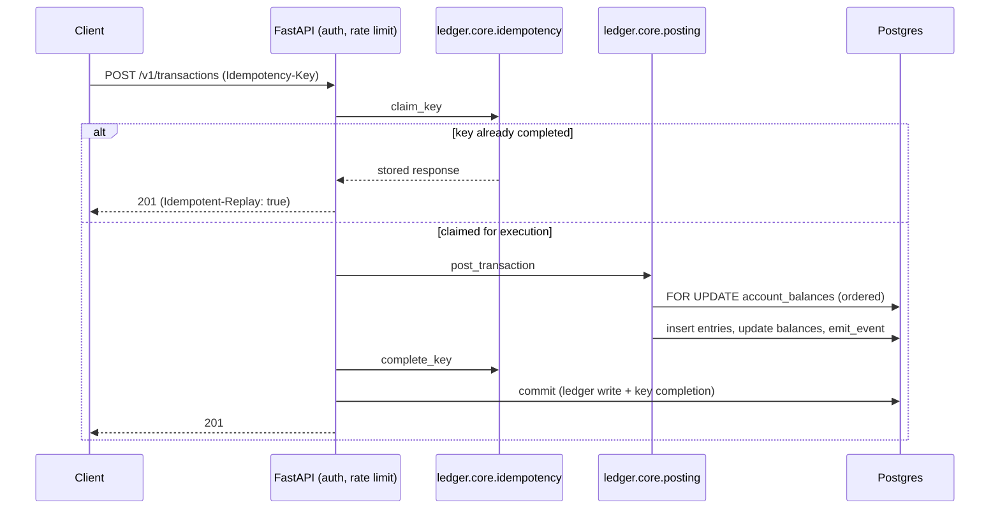

# Ledgerline

A double-entry payments ledger with an HTTP API on top. It's built around three problems that show up in any real payments system: retried requests can't double-post money, concurrent writes to the same account can't corrupt a balance, and when an external settlement feed disagrees with what the ledger recorded, that gets surfaced instead of quietly ignored.

The full build spec is in [`SPEC.md`](SPEC.md). If you want the reasoning behind specific decisions, that's in [`docs/ARCHITECTURE.md`](docs/ARCHITECTURE.md) and [`docs/DECISIONS.md`](docs/DECISIONS.md).

## Architecture


The API and the webhook worker are separate processes. If a webhook receiver is slow or down, that shouldn't back up request handling on the API side. There's also a scheduled job that clears out old idempotency keys so that table doesn't just grow forever.

Here's a single transaction post end to end, idempotency check included:



The ledger write and the idempotency key completion happen in the same commit, which is the whole point. If the process dies before that commit, the key is stuck at `in_progress` and nothing was written, so a retry after the lock TTL just runs cleanly like nothing happened.

## Running it locally

```bash
cp .env.example .env          # edit if needed
docker compose up -d db
pip install -e ".[dev]"
alembic upgrade head
uvicorn ledger.api.main:app --reload
```

Tests:

```bash
pytest
```

If `DATABASE_URL` isn't set, it spins up a throwaway Postgres through testcontainers instead of touching anything real.

## Dashboard

There's a server-rendered dashboard at [http://localhost:8000/dashboard](http://localhost:8000/dashboard) (Jinja2 + htmx, live updates over SSE). It shows account balances, recent transactions, reconciliation runs with their open findings, and the webhook queue with retry countdowns and dead-letter depth.

```bash
docker compose up            # api + dashboard + webhook worker + db
python -m scripts.seed       # accounts and a small transaction history
```

Panels are fed from `GET /dashboard/sse`, which pushes a fresh snapshot every `DASHBOARD_SSE_INTERVAL_SECONDS` (2s default) for whichever panel actually changed.

### Demo scenario

The dashboard has a "Run demo scenario" button (`POST /dashboard/demo`, or `python -m scripts.demo` if you'd rather run it from a terminal). It seeds settlement drift plus a webhook endpoint that's rigged to fail, so you can watch reconciliation findings, auto-resolution, retry backoff, and the DLQ all happen without setting any of it up by hand.

It's off unless `DEMO_ENABLED=true` is set, which it already is for the `app` service in `docker-compose.yml`, so it works out of the box locally. It does write real transactions, so don't enable it against a ledger you actually care about. Each click adds a new scenario on top instead of replacing the last one.

## Webhook delivery

Delivery is at-least-once, not exactly-once. If a worker dies mid-delivery, a sweep picks up the stale claim and puts it back to `pending` for redelivery. Receivers need to dedupe on their end using the `X-Ledgerline-Event-Id` header, since an event isn't guaranteed to arrive only once.

The delivery worker runs next to the API (`docker compose up` starts both, or run it alone with `python -m worker.webhook_worker`). Register an endpoint with `POST /v1/webhooks/endpoints`. The `secret` in that response is shown exactly once, so grab it right away since you'll need it for verifying signatures later.

Headers on every delivery:

| Header | Value |
|---|---|
| `X-Ledgerline-Event-Id` | UUID of the outbox event, dedupe on this |
| `X-Ledgerline-Timestamp` | Unix seconds at send time |
| `X-Ledgerline-Signature` | `sha256=<hex>`, `HMAC-SHA256(secret, f"{timestamp}." + raw_body)` |

Verifying one looks like this (same logic as `ledger.webhooks.signing.verify`):

```python
import hmac
from hashlib import sha256

def verify(secret: str, timestamp: str, raw_body: bytes, signature_header: str) -> bool:
    expected = hmac.new(secret.encode(), f"{timestamp}.".encode("ascii") + raw_body, sha256).hexdigest()
    prefix, _, candidate = signature_header.partition("=")
    return prefix == "sha256" and hmac.compare_digest(candidate, expected)
```

Make sure you're signing the raw request body bytes, not something you parsed and re-serialized yourself. Re-encoding JSON can reorder keys or change whitespace, and that alone will break verification even though nothing was tampered with.

A delivery goes `dead` once it burns through its retry budget, or immediately if the receiver returns a 4xx that isn't a 429. A dead delivery can be replayed manually with `POST /v1/webhooks/deliveries/{id}/retry`, which resets the attempt count and queues it back up.

## Reconciliation

The ledger is the source of truth here. If a settlement line shows up that the ledger has no record of, it's fine to absorb automatically through a suspense account. It doesn't work in the other direction though: a ledger transaction the feed hasn't confirmed yet is never treated as wrong. It just sits as `missing_settlement` / `unresolved` until someone looks at it, since the feed might just be running behind schedule.

Auto-resolution has a ceiling too. Only differences at or under `RECON_AUTO_RESOLVE_THRESHOLD_MINOR` (default $5.00) get posted automatically; anything above that needs a manual `POST /v1/reconciliation/findings/{id}/resolve`. Running reconciliation twice over the same window is safe, since it won't duplicate findings or touch something already resolved.

## Auth

Every `/v1` route needs `Authorization: Bearer <key>`. `/healthz`, `/readyz`, `/metrics`, and `/dashboard` don't require it.

```bash
python -m ledger.admin.keys mint --name my-integration   # prints the raw key once -- save it
python -m ledger.admin.keys list
python -m ledger.admin.keys revoke --id <uuid>
```

Only a SHA-256 hash of the key is stored, never the raw value. A revoked key and one that never existed both come back as the same `401 /errors/unauthenticated`, so nobody can use the response to check whether a guessed key was ever valid. Lookups are cached for `API_KEY_CACHE_TTL_SECONDS` (30s by default), so revocation can take up to that long to actually kick in. Set it to `0` for instant revocation, but that costs a DB read per request.

## Rate limits

100 req/s per API key, burst of 200, enforced in-process (`RATE_LIMIT_RPS`, `RATE_LIMIT_BURST`, or just disable with `RATE_LIMIT_ENABLED`). Over the limit gets you a `429 /errors/rate-limited` with `Retry-After`. Since the limiter is in-process, it's effectively per web machine, not per deployment. See the single `--workers 1` web process in `fly.toml`.

## Metrics

`GET /metrics`, Prometheus text format, no auth required (turn off with `METRICS_ENABLED`):

| Metric | Kind | Where it comes from |
|---|---|---|
| `transactions_posted_total` | counter | `ledger.core.posting` |
| `entries_written_total` | counter | `ledger.core.posting` |
| `idempotency_replays_total` | counter | `ledger.api.errors` |
| `idempotency_conflicts_total` | counter | `ledger.api.errors` |
| `posting_latency_seconds` | histogram | `ledger.core.posting` |
| `webhook_deliveries_total{status}` | gauge | read from `webhook_deliveries` at scrape time |
| `webhook_dlq_depth` | gauge | read from `webhook_deliveries` at scrape time |
| `reconciliation_findings_total{type}` | gauge | read from `reconciliation_findings` at scrape time |

The three gauges are read fresh at scrape time rather than tracked in-process. The webhook worker and a reconciliation run don't have their own HTTP server for Prometheus to scrape, so this is the workaround.

## Deploying

[`docs/DEPLOY.md`](docs/DEPLOY.md) covers the one-time Fly.io setup: creating the app, managed Postgres, the first API key, the scheduled idempotency-key cleanup, and turning on CD. `fly.toml` and `.github/workflows/cd.yml` are ready to use, but nothing's actually been deployed from this repo so far, so there's no Fly app or secret sitting around until that setup gets run.

## Load testing

[`loadtest/`](loadtest/README.md) has a Locust scenario for throughput and posting-latency percentiles against a running instance. It's manual and not wired into CI; that README covers why, plus the last numbers that got recorded.
